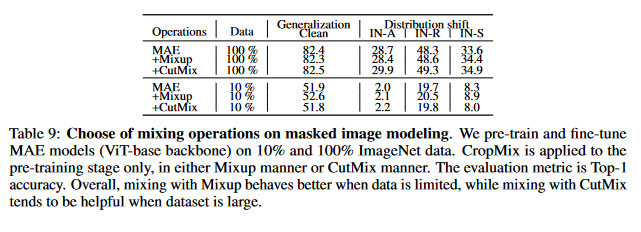

# CropMix

CropMix is a method for sampling input distribution. CropMix captures multi-scale information from the dataset distribution to form a richer input distribution for vision tasks. Compared to RRC (Random Resized Crop), CropMix shows positive results in image classification, contrastive learning, and masked image modeling. 

[CropMix: Sampling a Rich Input Distribution via Multi-Scale Cropping](https://arxiv.org/abs/2201.12078) <br>
[Junlin Han](https://junlinhan.github.io/), [Lars Petersson](https://people.csiro.au/P/L/Lars-Petersson), [Hongdong Li](http://users.cecs.anu.edu.au/~hongdong/), [Ian Reid](https://cs.adelaide.edu.au/~ianr/) <br>
DATA61-CSIRO and Australian National University and University of Adelaide <br>
Preprint, 2022

```
@inproceedings{han2022cropmix,
  title={CropMix: Sampling a Rich Input Distribution via Multi-Scale Cropping},
  author={Junlin Han and Lars Petersson and Hongdong Li and Ian Reid},
  booktitle={},
  year={2022}
}
```

CropMix utilizes multiple cropping operations with distinct crop scales to obtain multiple cropped views. Gradually mixing these cropped views produces a mixed
image containing multi-scale information. 


## Easy usages
This is a demo of employing CropMix to create your training dataset. 
```
import torchvision.transforms as transforms
import torchvision.datasets as datasets
import cropmix

# CropMix configurations
parser.add_argument('--scale', default=0.01, type=float,
                    help='min crop scale')
parser.add_argument('--mix_ratio', default=0.4, type=float,
                    help='mixing ratio/weight for mixup')
parser.add_argument('--number', default=234, type=int,
                    help='number of crops/cropping operations. support 2, 3, 4 and 234, where 234 is for (2,3,4)')
parser.add_argument('--operation', default=0, type=int,
                    help='mixing operation, 0 for mixup, 1 for cutmix')
parser.add_argument('--inter_aug', action='store_true',
                    help='apply intermediate augmentation (channel permutation)')

# path to your dataset
traindir = os.path.join(args.data, 'train')

# post augmentation, usually horizontal flip and normalization
post_aug = transforms.Compose([
    transforms.RandomHorizontalFlip(),
])

# create your training dataset with cropmix
train_dataset = datasets.ImageFolder(
    traindir,
    cropmix.CropMix(args.scale, args.mix_ratio, args.number, args.operation, args.inter_aug,  post_aug))

```

## Prerequisites
This repo aims to be minimal modifications on [official PyTorch ImageNet training code](https://github.com/pytorch/examples/tree/master/imagenet), [asym-siam](https://github.com/facebookresearch/asym-siam), and [mae](https://github.com/facebookresearch/mae). Following their instructions to install the environments and prepare the datasets.

[timm](https://github.com/rwightman/pytorch-image-models) is also required for ImageNet classification, simply run

```
pip install timm==0.3.2
```

## CropMix and RRC visualization


## Results
Here we present some results of applying CropMix on three vision tasks, please see our paper for full results. 

ImageNet classification:


Contrastive learning:


Masked image modeling:

 

<br>
## Training and testing
Please see each sub-folder for detailed instructions.

## Contact
junlin.han@data61.csiro.au or junlinhcv@gmail.com

If you tried CropMix in other tasks and datasets, please feel free to let me know the results. They will be collected and presented in this repo, regardless of positive or negative. Thank you!

## Acknowledgments
Our code is developed based on [official PyTorch ImageNet training code](https://github.com/pytorch/examples/tree/master/imagenet), [asym-siam](https://github.com/facebookresearch/asym-siam),  [mae](https://github.com/facebookresearch/mae), and [YOCO](https://github.com/JunlinHan/YOCO). This repo borrows heavily from [YOCO](https://github.com/JunlinHan/YOCO).


