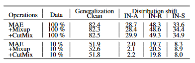

### CropMix configurations
```
scale:  min crop scale
mix_ratio: mixing ratio/weight for mixup
number: number of crops/cropping operations. support 2, 3, 4 and 234, where 234 is for (2,3,4)
operation: mixing operation, 0 for mixup, 1 for cutmix
inter_aug: apply intermediate augmentation (channel permutation)
```

For mixing operation, MixUp is good for small-scale dataset (10% ImageNet) while CutMix performs much better in ImageNet-1k. 



## Pre-training MAE on a single machine

To reproduce our experiments on ImageNet-1k (4 GPUs for training):

Use Mixup as mixing operation:
```
python3 -m torch.distributed.launch --nproc_per_node=4 main_pretrain.py --batch_size 64 --model mae_vit_base_patch16  --accum_iter 16 --norm_pix_loss --mask_ratio 0.75 --epochs 200 --warmup_epochs 20 --blr 1.5e-4 --weight_decay 0.05 --pin_mem --scale 0.2 --mix_ratio 0.4 --number 234 --operation 0
```
or CutMix:
```
python3 -m torch.distributed.launch --nproc_per_node=4 main_pretrain.py --batch_size 64 --model mae_vit_base_patch16  --accum_iter 16 --norm_pix_loss --mask_ratio 0.75 --epochs 200 --warmup_epochs 20 --blr 1.5e-4 --weight_decay 0.05 --pin_mem --scale 0.2 --number 2 --operation 1
```

## Pre-trained CropMix + MAE weights 

We provide the [weights of ViT-base pre-trained on ImageNet-1k and 10% ImageNet](https://drive.google.com/drive/folders/1t4U5I0aYYWmpWiEddOo9ae6a3-m6jOIQ?usp=sharing). The mixing operation are CutMix and Mixup, respectively.

checkpoint-199.pth: MAE pre-trained on ImageNet-1k for 200 epochs, with cutmix as mixing operation. 
checkpoint-299.pth: MAE pre-trained on 10% ImageNet for 300 epochs, with mixup as mixing operation. 


## Pre-training MAE with multiple machines
We didn't try this, commands here are identical to the original MAE repo. You might add CropMix configurations (--scale 0.2 --number 2 --operation 1) to test the performance. 

To pre-train ViT-Large (recommended default) with **multi-node distributed training**, run the following on 8 nodes with 8 GPUs each:
```
python submitit_pretrain.py \
    --job_dir ${JOB_DIR} \
    --nodes 8 \
    --batch_size 64 \
    --model mae_vit_large_patch16 \
    --norm_pix_loss \
    --mask_ratio 0.75 \
    --epochs 800 \
    --warmup_epochs 40 \
    --blr 1.5e-4 --weight_decay 0.05 \
    --data_path ${IMAGENET_DIR}
```
- Here the effective batch size is 64 (`batch_size` per gpu) * 8 (`nodes`) * 8 (gpus per node) = 4096. If memory or # gpus is limited, use `--accum_iter` to maintain the effective batch size, which is `batch_size` (per gpu) * `nodes` * 8 (gpus per node) * `accum_iter`.
- `blr` is the base learning rate. The actual `lr` is computed by the [linear scaling rule](https://arxiv.org/abs/1706.02677): `lr` = `blr` * effective batch size / 256.
- Here we use `--norm_pix_loss` as the target for better representation learning. To train a baseline model (e.g., for visualization), use pixel-based construction and turn off `--norm_pix_loss`.
- The exact same hyper-parameters and configs (initialization, augmentation, etc.) are used as our TF/TPU implementation. In our sanity checks, this PT/GPU re-implementation can reproduce the TF/TPU results within reasonable random variation. We get 85.5% [fine-tuning](FINETUNE.md) accuracy by pre-training ViT-Large for 800 epochs (85.4% in paper Table 1d with TF/TPU).
- Training time is ~42h in 64 V100 GPUs (800 epochs).

To train ViT-Base or ViT-Huge, set `--model mae_vit_base_patch16` or `--model mae_vit_huge_patch14`.
